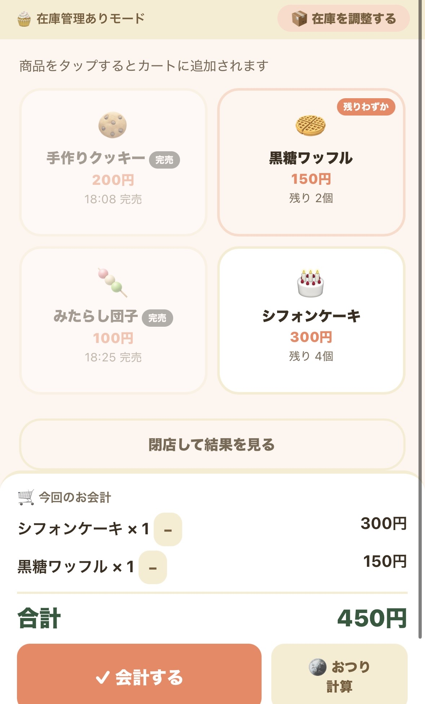

# あれ売れた？

## 🌟 これは何？

**あれ売れた？** は、バザー・夏祭り・文化祭などで使える、かんたんイベント販売レジアプリです。

レジとして使いながら、「何が」「いくつ」「いつ売り切れたか」を記録できます。
イベント後は、会計報告や次回への引継ぎに使える販売レポートも作れます。

## 🚀 公開URL

[▶ アプリを開く](https://takoyaki-project.github.io/are-ureta-event-register/)

## ✨ できること

* 商品を登録して、レジのように販売記録をつけられる
* 売上・販売数・残り数・完売時間を自動で記録できる
* 在庫管理あり／レジのみの販売方式を選べる
* おつり計算ができる
* 直前の会計を取り消せる
* 在庫の追加・破損・数え直しなどを記録できる
* イベント終了後に、商品別の結果や引継ぎレポートを確認できる
* スマホ・タブレットで使いやすい画面設計
* PWA対応で、ホーム画面に追加して使える

## 📱 使い方

1. 「新しいイベントをはじめる」から、イベント名・日付・担当コーナーを入力します。
2. 販売方式を選び、商品名・価格・準備数を登録します。
3. 開店したら、商品ボタンをタップして会計します。
4. 必要に応じて、おつり計算や在庫調整を使います。
5. 閉店後、売上・販売数・完売時間・残り数を確認します。
6. 引継ぎレポートを見て、会計報告や次回の準備に使います。

## 🖼 スクリーンショット
<table>
  <tr>
    <td></td>
    <td></td>
  </tr>
</table>

## 🛠 使用技術

* HTML
* CSS
* JavaScript
* localStorage
* PWA
* GitHub Pages

## 📝 制作メモ

学校バザーや夏祭り、文化祭などのイベント販売では、当日はとにかくバタバタしがちです。

「何が何個売れたのか」
「いつ売り切れたのか」
「来年は何個用意すればいいのか」

そういった記録が、あとから分からなくなることがあります。

そこで、レジとして使いながら自然に販売記録が残り、イベント後の会計報告や引継ぎにも使えるアプリを作りました。

おばあちゃん世代の方や学生さんでも使いやすいように、ボタンを大きめにし、できるだけ分かりやすい言葉で作っています。

今後は、実際にイベントで使ってもらいながら、レジのみモードやレポート機能をさらに改善していく予定です。

## ⚠ 注意事項

* 販売データは、使用している端末のブラウザ内に保存されます。
* 別のスマホ・タブレット・PCとは自動で共有されません。
* イベント当日は、できるだけ同じ端末で使ってください。
* オフライン利用を想定していますが、初回表示やホーム画面追加はオンライン環境で行ってください。
* 試作版のため、実際のイベントで使う前に一度テストしておくことをおすすめします。

## 🐙 TAKOYAKI PROJECT

The development never ends.
